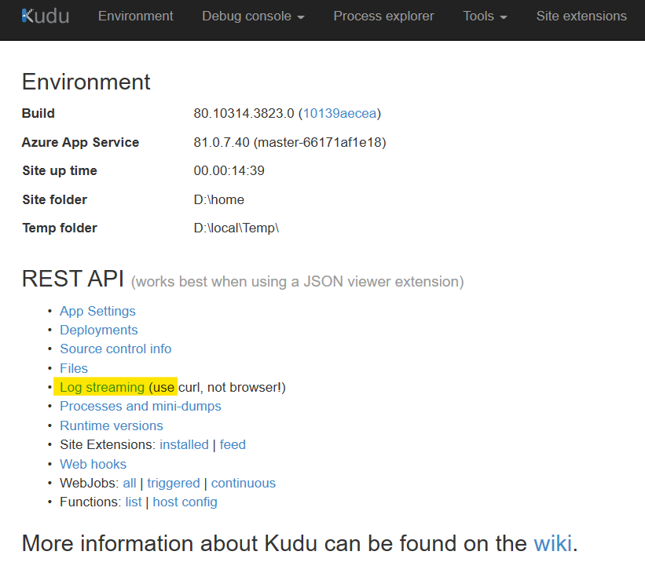

# Google Assistant Proxy
> [here for Spanish document](README.es-es.md)

By installing and configuring this proxy service, we can interact with our *Bot Framework* from *Google Assistant*

For this, we have to create a project in *Action on Google* that points to our proxy service. This in turn, will communicate with your bot using [*Direct Line*](https://docs.microsoft.com/en-us/azure/bot-service/bot-service-channel-connect-directline?view=azure-bot-service-4.0). 

> Note: If you are not familiar with *Actions on Google*,I recommend you try these [labs](https://developers.google.com/actions/codelabs/).

## Quick guide 
### 1. Download the code and compile the solution 


> if you can´t open the projects correctly, it means you don´t have the components installed *development of Node.js*.
>
>

### 2. Publish the project *GoogleAssitantProxy*.

You can also test the project locally using ***ngrok***. I show you how [aqui](docs/googleAssistantProxy.deploy.local.es.md). 

Once you´ve tried the solution, I recommend you integrate it into your solution and deploy it together using *DevOps*.

### 3. Configure settings 

Add setting **DIRECT_LINE_SECRET**
 with the *secret key* from the *Direct Line* channel of your bot.

Make sure that the Node version is at least 7.10.1 (in Azure through *setting* **WEBSITE_NODE_DEFAULT_VERSION**)

> I show you how [here](docs/Azure.settings.es.md)

### 4. Configure templates *actions.json*
   
Update **templates form *GoogleAction*** with url from your *GoogleAssitantProxy*. (a template for each language that supports our bot).

>in the *Deployment* folder  there are two example templates (one for English and the other for Spanish).
   ```json
   {
    "locale": "es",
    "actions": [{
        "description": "<description>",
        "name": "MAIN",
        "fulfillment": {
            "conversationName": "MAIN_CONVERSATION"
        },
        "intent": {
            "name": "actions.intent.MAIN",
          "trigger": {
            "queryPatterns": [ "Speak with <name of your bot>", "Hi <name of your bot>", "I want to speak to<name of your bot>"]
            }
        }
    }],
    "conversations": {
      "MAIN_CONVERSATION": {
        "name": "MAIN_CONVERSATION",
        "url": "<url-of-your-deployment-GoogleAssitantProxy>",
        "inDialogIntents": [
          {
            "name": "actions.intent.CANCEL"
          }
        ],
        "fulfillmentApiVersion": 2
      }
    }
}
   ```
   
 ### 5. Update your project *Actions for Google*

- Update in the script ***GoogleActionDeploy.cmd*** your porject identifier *Actions for Google*
   ```
   gactions update --project PROJECTID --action_package action.es.json --action_package action.en.json
   ```
- Run script ***GoogleActionsDeploy*** (if it´s the first time you´ve done it, you need to authenticate it with your Google account).

  > This script uses ***gactions CLI***, which is the command line tool to update the projects of *Actions on Google*. More information [here](https://developers.google.com/actions/tools/gactions-cli).
  >  
  > To obtain the identifier of the project. In the console [*Actions on Google*](https://console.actions.google.com) of your project, *Settings* (the nut), *Project ID*.
  >  

 ### 6. Check if it works 
  Test in the simulator of the[console](https://console.actions.google.com) of 'Actions for Google' and see if it responds.

> You can see the ***console in Azure*** in *Advanced Tools*, *Log streaming*
>
>  


 ### 7. Configure *GoogleAssitantProxy*
 Now that we have configured all the infrastructure, we will now configure our proxy to better adapt it to our bot.

 - Welcome messages, etc. [here](docs/googleAssistantProxy.messages.es.md)
 - Other possible settings. [here](docs/googleAssistantProxy.settings.es.md)

 ## Recognition 
 Many thanks to *Capgemini* for the very impressive work they have carried out [here](https://github.com/Capgemini-AIE/bot-framework-actions-on-google). This code was inspired by their work. 

 To [@juliapiedrahita](https://twitter.com/juliapiedrahita) for starting this project and making the work easier. 


