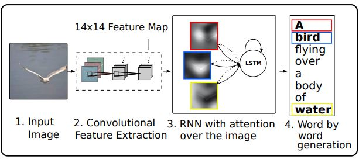
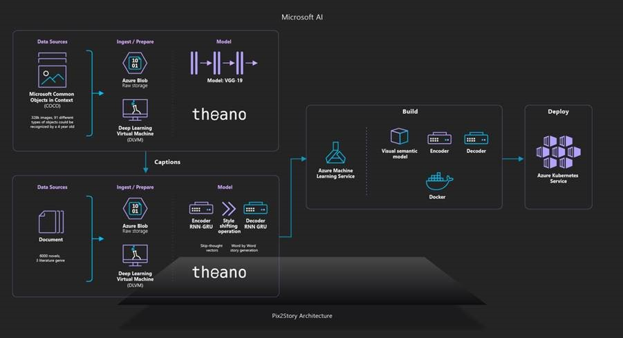

# StoryTelling

[Pix2Story](https://www.ailab.microsoft.com/) is an AI that generates stories about an image in different literary genres. Based on the paper [Skip-Thought Vectors](https://arxiv.org/pdf/1506.06726.pdf) by Ryan Kiros, Yukun Zhu, Richard S. Zemel, Antonio Torralba, Raquel Urtasun, Sanja Fidler and in the results in the git [neural-storyteller](https://github.com/ryankiros/neural-storyteller) by Ryan Kiros, Yukun Zhu and Michael J. Lumpe.

## Dependencies

- `Python 3.5`
- `Theano 1.0.2`
- `pygpu 0.7.6`
- `Lasagne 0.2.dev1`

environment.yml :

- `azureml-defaults`
- `scikit-image`
- `nose`
- `nltk`
- `Cython`
- `sklearn`
- `Pillow`
- `azureml-sdk`
- `opencv-python==3.3.0.9`
- `scipy`

## Process Flow

### Visual Semantic Embedding

The first part of the project is the one that transforms the input picture into captions. Captions describes briefly the picture as is shown in the example below.

*A white dog that is looking at a frizbee*
*Small white dog with green and white boe tie on*
*A white dog with black spots is sitting on the grass*

The model employed to generate this captions is composed by two different networks. First one is a convolutional neural network in order to extract a set of feature vectors refered as annotation vectors.

The second part of the model is a long short-term memory (LSTM) network that produces a caption by generating one word at every time step conditioned on a context vector, the previous hidden state and the previously generated words.

### Skipthought Vectors

Skipthought Vectors by R. Kiros is a model that generates generic sentences representations that can be used in different task. In particular for this project the idea is train an encoder-decoder model that tries to reconstruct the surrounding sentences of an encoded passage using the continuity of text from books. 
 

 The model is an ecoder-decoder model. The encoder is used to map a sentence into a vector. The decoder then conditions on this vector to generate a translation for the source sentence.

The vocaulary used has been expanded using google news pretrained vectors by generating a linear regressor that maps words in the founded in books vocabulary to words in this vectors.

### Style shifting

Attending to skipthoughts functioning if the sentences given to the encoder from the VSE are short descriptive sentences the final output will be a short sentence. For that reason if the desired output is a more literary passage we need to make a style shifting.
That means to operate with skipthought vectors representations to set the input to the characteristics we want to induce in the output. The operation is the following:

Skipthoughts Decoder Input = Encoded Captions of the picture - Average All Captions Encoded + Encoded Passages with similar lenght and features as the output we expect   

## Deployment

This project has been deployed using Azure Machine Learning Services Workspaces to generate the Docker image with the files and all models involved in prediction. The deployment for consumption has been made using Azure Kubernetes Services to automatically scale the solution.

## Train your own model

For train new models:
- Create conda environment:

    `conda env create --file environment.yml`
    
- Activate conda env:

    `activate storytelling`

- Set paths to your books or texts and your training settings in config.py

- Run training.py to train a encoder, generate necessary files and train a decoder based on your texts

- Generate bias: Mean of encoded sentences and mean of encoded captions

- To generate stories run the following on a python console:

    `>import generate`

    `>story_generator = generate.StoryGenerator()`

    `>story_generator.story(image_path='path/to/your/image')`