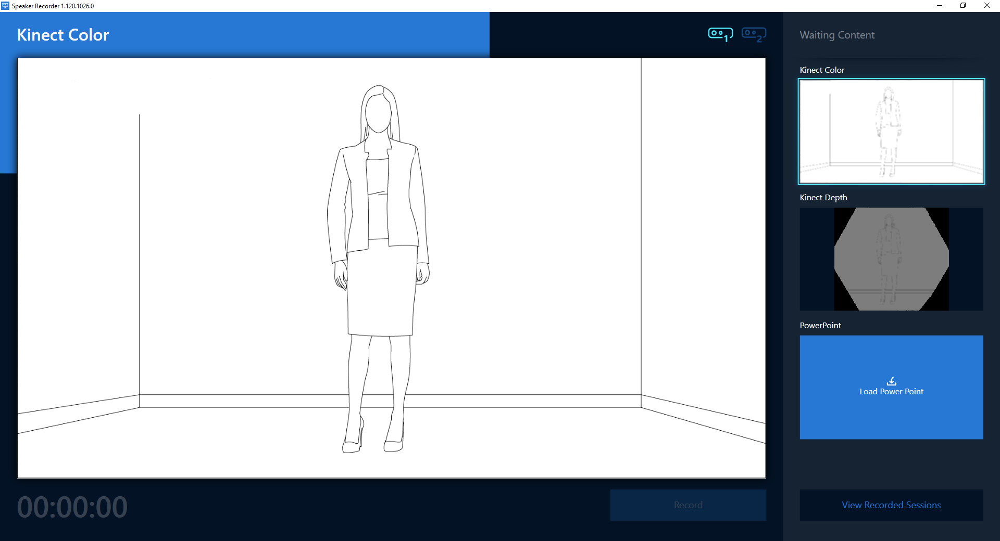
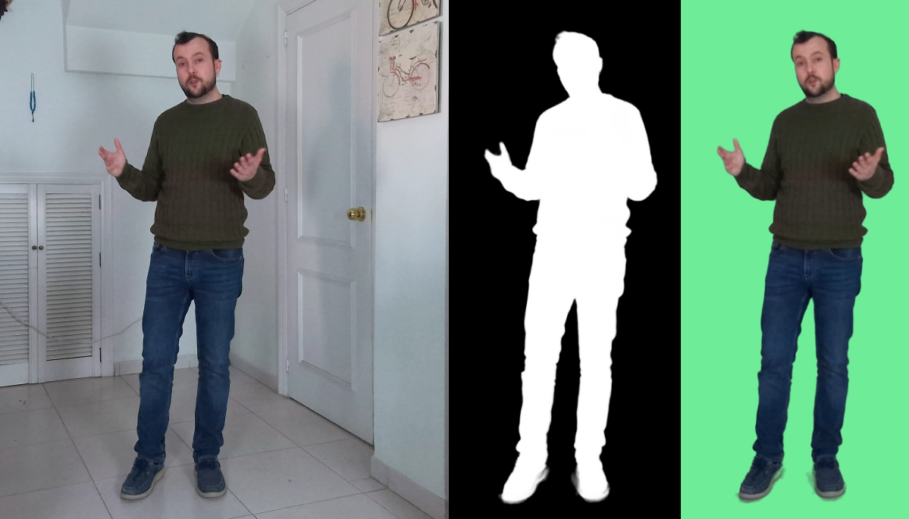

# Virtual Stage

The Virtual Stage lab allows a speaker to record himself at an usual environment as its
home or office, generating a video like he were in a professional studio with a green screen.

It consists of two applications:

* [__Speaker Recorder App__](#speaker-recorder-app): allows you to record a lecture using an Azure Kinect device.
* [__Background Matting__](#background-matting): processes the video to remove the background with great quality.
  * [__Kinect Mask Generator__](#kinect-mask-generator): CLI that generates the body segmentation from an Azure Kinect Video

## How to capture videos

Camera must be in a fixed base like a tripod.

For Azure Kinect video capturing, use the [Azure Kinect recorder](https://docs.microsoft.com/bs-latn-ba/azure/Kinect-dk/azure-kinect-recorder) or the _Speaker Recorder_ app.

Five seconds of background (no person in the camera) must be recorded at the beginning.
To this end, start recording standing outside the scene. Then, after five seconds, enter the scene and start your performance.

### Notes on environment set-up

For best results capture images following these guidelines:

* Choose a background that is mostly static, can be both indoor and outdoor.
* Avoid casting any shadows of the subject on the background.
  * place the subject at least 4 feet away from the background.
  * if possible adjust the lighting to avoid strong shadows on the background.
* Avoid reflections in the background and the subject (for example glasses reflections could introduce some errors).
* Avoid large color coincidences between subject and background. (e.g. Do not wear a white shirt in front of a white wall background.)
  * In general, background colors should be as complementary as possible to the speaker ones.
  * Avoid scenes where the subject moves in front of a background that have many color changes.
* If because of the above there is some part of the background that is causing errors, and changing the background is not possible, you could try to hide that part with some element. If using a fabric, be sure to put it in a way that it does not have wrinkles. Otherwise results can worsen.
* To minimize shadows/errors in certain floors, a carpet or similar can help.
* If using a general camera, lock AE/AF (Auto-exposure and Auto-focus) of the camera

If using an Azure Kinect camera, take as well into account these recommendations:

* Lock the exposure of the camera.
* Avoid using loose/airy clothes like big skirts.
* Large black zones in clothes cannot be seen by the Azure Kinect Depth sensor.

## Speaker Recorder App

Speaker Recorder is a Windows application to record from one or two Azure Kinect devices and a
PowerPoint file including audio from the default input device.



### Features

Speaker Recorder is a .Net Core 3 app built using WPF and UWP APIs, that offers the following features:

* Record from up to two Azure Kinect devices.
  * Using [Azure Kinect SDK](https://github.com/microsoft/Azure-Kinect-Sensor-SDK) custom built from pull request [#822](https://github.com/microsoft/Azure-Kinect-Sensor-SDK/pull/822).
* Record a PowerPoint slide show including the audio from the default input device.
  * Using the UWP GraphicsCaptureItem API and [NAudio](https://github.com/naudio/NAudio).
* Play all videos to review the result.
  * The player has been implemented using XAML Islands, to benefit from the performance of the UWP MediaPlayerElement.
* Upload the result to Azure Storage (you must configure the ConnectionString in the app.settings.json file).
  * The [Azure Storage Data Movement Library](https://github.com/Azure/azure-storage-net-data-movement) allows us to manage the upload of the recorded files due to their huge size.

### Requirements

To build the Speaker Recorder app you need:

* Windows 10 64 bits, version 1903, or a later release
* Windows 10 SDK, version 10.0.18362
* Visual Studio 2019 16.5.5

To run the application, the following prerequisites must be installed:

* Windows 10 64 bits, version 1903, or a later release
* [.Net Core 3.1 Desktop Runtime](https://dotnet.microsoft.com/download/dotnet-core/thank-you/runtime-desktop-3.1.3-windows-x64-installer)
* [Visual C++ Redistributable](https://aka.ms/vs/16/release/VC_redist.x64.exe)

## Background Matting

Given a set of videos recorded with Azure Kinect in which a speaker gives a talk, this command line tool removes the speaker's background and generates an alpha layer of the foreground.



This work is based on [Background Matting: The World is Your Green Screen](http://grail.cs.washington.edu/projects/background-matting/)

### Improvements over the original work

By using the Azure Kinect sensor depth capabilities to segment the speaker we
improve the precision of the background matting, and the errors reduce
considerably when processing videos with a non favorable backgrounds.

Due to the lack of labeled training data portraying standing humans, the AI is trained with 512x512 square images/videos until the hip or knee-length, resulting in poor quality when matting full HD standing human videos.

We have managed to obtain fine-grain quality in zones like hair, hands or feet in these cases by splitting the body in two square images with a small overlapping and processing them separately.

### Requirements

* Windows 10 x64 and NVIDIA graphics card.
* Install NVIDIA CUDA 10.0 and NVIDIA CudNN.
* Conda environment
  * Install [miniconda](https://docs.conda.io/en/latest/miniconda.html)
  * Go to powershell terminal and install environment

  ```powershell
  conda init
  exit
  conda env create -f .\environment.yaml
  ```

* OpenCV 4.3.0
  * Download [OpenCV 4.3.0](https://sourceforge.net/projects/opencvlibrary/files/4.3.0/opencv-4.3.0-vc14_vc15.exe/download)
  * Install on _3rdparty/opencv_ directory
  * Add to Path `[ROOT]\3rdparty\opencv\build\x64\vc15\bin`
* FFMPEG 4.2.2
  * Download [ffmpeg 4.2.2](https://ffmpeg.zeranoe.com/builds/win64/static/ffmpeg-4.2.2-win64-static.zip)
  * Extract directory in _3rdparty/ffmpeg-4.2.2_ directory
  * Add to Path `[ROOT]\3rdparty\ffmpeg-4.2.2\bin`
* Visual C++ Redistributable
  * [Download](https://aka.ms/vs/16/release/VC_redist.x64.exe) and install
* Inference models
  * Download [models](https://drive.google.com/drive/folders/1WLDBC_Q-cA72QC8bB-Rdj53UB2vSPnXv?usp=sharing)
  * Place _Models\\_ folder inside root directory
* Azure Kinect SDK 1.4.0
  * [Download](https://download.microsoft.com/download/4/5/a/45aa3917-45bf-4f24-b934-5cff74df73e1/Azure%20Kinect%20SDK%201.4.0.exe) and install
  * Add to `PATH` the bin folder `C:\Program Files\Azure Kinect SDK v1.4.0\sdk\windows-desktop\amd64\release\bin`
* Azure Kinect Body Tracking SDK 1.0.1
  * [Download](https://www.microsoft.com/en-us/download/details.aspx?id=100942) and install
  * Add to `PATH` the bin folder `C:\Program Files\Azure Kinect Body Tracking SDK\sdk\windows-desktop\amd64\release\bin`

### Removing the background

Put the videos you want to process in a folder, and create an output folder in your system as well. Using fast storage disks will short the total processing time.

Edit `run.ps1` accordingly to parameters below and run it on _PowerShell_.

Note: If you have more than one graphic card, set its device number at `CUDA_VISIBLE_DEVICES`

Parameters:

```text
  -h, --help            show this help message and exit
  -n NAME, --name NAME  Name of processing.
  -i INPUT, --input INPUT
                        Path to videos folder.
  -o OUTPUT_DIR, --output_dir OUTPUT_DIR
                        Directory to save the output results.
```

Additional parameters:

```text
  -s START, --start START
                        Start point to process (in seconds). Default 0.
  -d DURATION, --duration DURATION
                        Duration of the processed video (in seconds). Set to '-1'
                        to process till the end of the video. Default '-1'.
  -ft FIXED_THRESHOLD, --fixed_threshold FIXED_THRESHOLD
                        Comma separated list to set which videos must be split
                        in two according to a fixed threshold before processing.
                        For example, for two videos where we want to split the
                        first one (alphabetical order) by the line 640, set this
                        parameter to "640" or "640,".
  -shp SHARPEN, --sharpen SHARPEN
                        Enable sharpen original color image to help on noise
                        removal. Default to False.
  -mask_ops MASK_OPS, --mask_ops MASK_OPS
                        Morphological operations to apply to masks for each
                        inferred video. Format [erode|dilate],KernelSize,Iterations;...;
                        blur,KernelSize,SigmaX:[...].
                        Default "erode,3,10;dilate,5,5;blur,31,0" for each video.
                        Specify "-" to not use any morphological operation on
                        the mask.
  -o_types OUTPUT_TYPES, --output_types OUTPUT_TYPES
                        Output types generation separated by comma. Valid
                        values are out,matte,compose,fg. Default "out,matte".
  -bg BACKGROUND, --background BACKGROUND
                        Path to background video directory for compose output.
  --kinect_mask
                        Enable the use of azure kinect mask (Default).
  --no_kinect_mask
                        Disable the use of azure kinect mask.
  -i_ext INPUT_EXTENSION, --input_extension INPUT_EXTENSION
                        Input videos extension. Only if not using Azure Kinect
                        videos.
```

#### Kinect Mask Generator

To get the body segmentation from the Azure Kinect Video, the app uses a small CLI tool written in C++. [Check it out](KinectMaskGenerator/)!.
